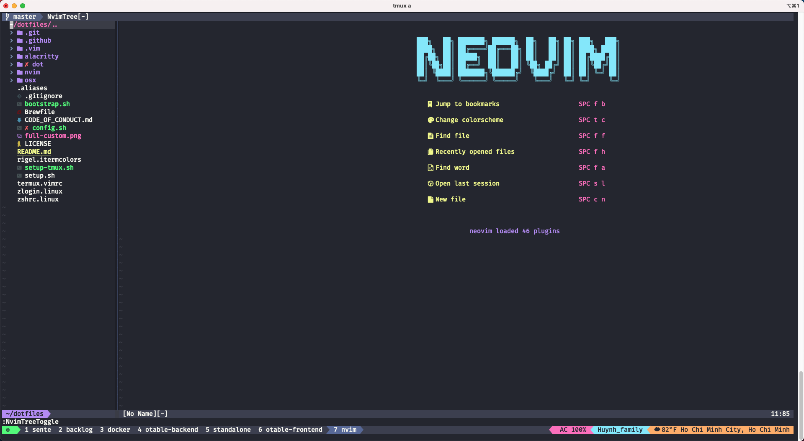

# dotfiles

## Iterm2 + zsh + tmux + vim

## Getting started

1. setup git and github

- ssh key
- gpg key



## Install

### Homebrew

```zsh
xcode-select --install
sudo xcodebuild -license

sudo mkdir /usr/local
sudo chown -R `whoami` /usr/local
ruby -e "$(curl -fsSL https://raw.githubusercontent.com/Homebrew/install/master/install)"

brew doctor
```

### Tmux

- Install tmux plugin manager: https://github.com/tmux-plugins/tpm

### TODOs

[ ] migrate coc-nvim to lsp
[ ] use make as a script runner
